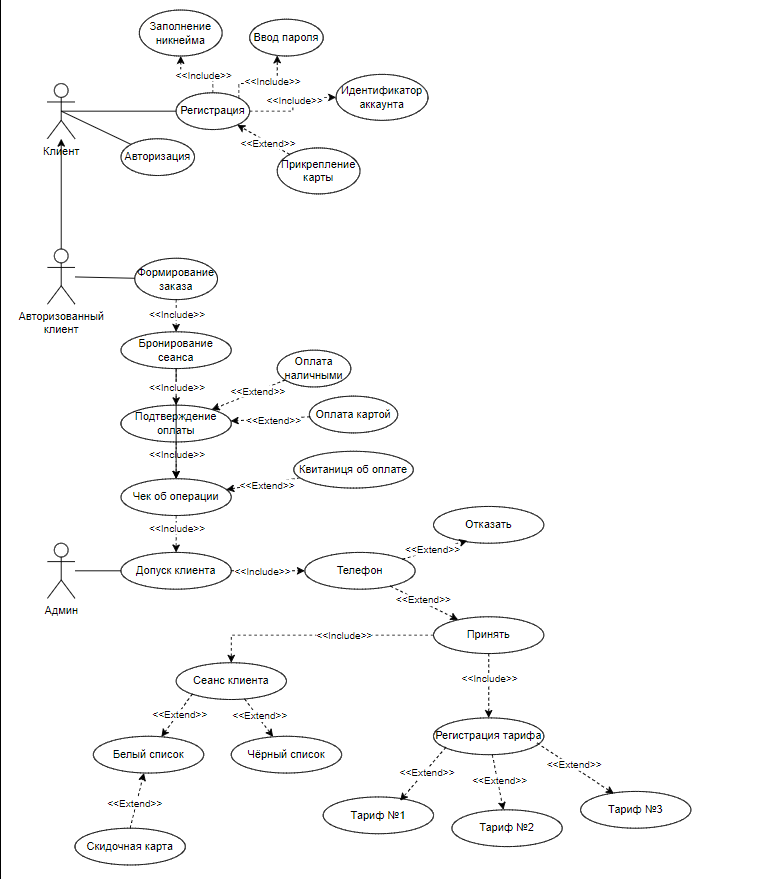
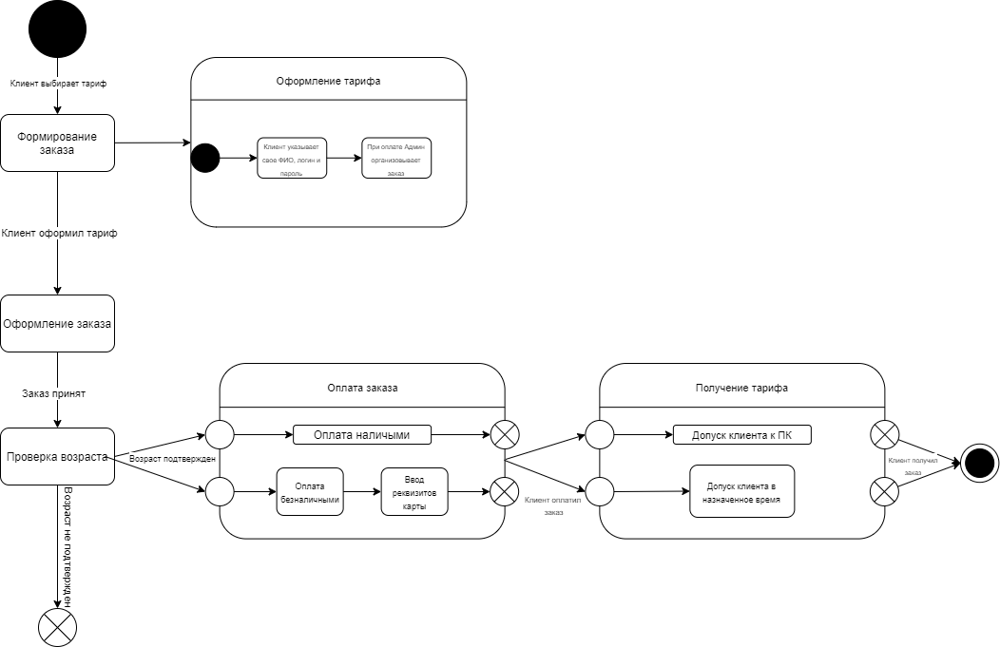

## Предметная область на тему
### “Компьютерный клуб”

Предполагается, что в системе компьютерного клуба будет 3 роли пользователей: клиенты, администраторы, места. Авторизация в системе производится по логину и паролю. Клиенты могут зарегистрироваться в системе, указав логин, телефон, пароль, дату рождения, ссылку профиля, никнейм.
Администраторы – пользователи с уже заполненным профилем. Они могут добавлять новых админов и записывать их на различные клубы с целью обслуживания клиентов. Постоянным клиентам администраторы могут предоставлять скидки на тарифы.
Любой клиент после авторизации может выбрать себе тариф (если у него нет такового). В этом случае клиент видит список тарифов с названием, информацией о железе ПК, цене и местоположении в комнате. Клиент может отправить заявку любому из админов, купив при этом тариф, который он хочет приобрести для провождения времени за ПК.
Админ после авторизации видит новые заявки от клиентов и их количество купленных часов. Админ принимает заявку, после чего допускает клиента до арендованного ПК. В случае возникших проблем, админ должен указать причину её возникновения. Выбрав из списка клиентов без плана тренировок, админ видит тариф клиента, его возраст и расставляет время занимаемого времени. Для индивидуальных заказов админ пишет список, где клиент записал что он хочет в добавку, где берётся за это дополнительная оплата заказа.
Админ также может посмотреть список своих текущих клиентов с указанием у каждого: проценты выполнения всего цикла времяпровождения за ПК (зависит от длительности цикла) и процента времени до конца.
## Диаграмма прецедентов (Вариантов использования).

## Сертификация вариантов использования (Прецедентов).
|  | |
| --- | ---| 
| Прецедент | Формирование заказа |
| Идентификатор | ID 1 |
| Краткое описание | Клиент формирует заказ |
| Главные акторы | Клиент |
| Второстепенные акторы | Админ | 
| Предусловия | нет
| Основной поток | 1. Прецедент начинается, когда Клиент формирует заказ  2. Клиент оформил тариф  3. Админ принимает заказ
| Альтернативные потоки | 2.1 Клиент указывает свое ФИО, логин и пароль  2.2 При оплате Админ организовывает заказ
| Постусловия | 1. Клиент оформил заказ  2. Покупатель отказался от покупки

| | |
---|---
Прецедент | Проверка на наличие возраста
Идентификатор | ID 2
Краткое описание | Клиент оформил заказ по возрастному ограничению
Главные акторы | Админ
Второстепенные акторы |  Клиент
Предусловия | Клиент оформил заказ
Основной поток | Прецедент начинается, когда Админ принимает заказ
Альтернативные потоки | Клиент заказывает тариф у админа
Постусловия | Возрастное ограничение

| | |
| --- | --- | 
| Прецедент | Оплата|
Идентификатор | ID 3
Краткое описание | Клиент оплачивает заказ по возрастному ограничению
Главные акторы | Клиент
Второстепенные акторы |  нет
Предусловия | Подходящий возраст
Основной поток | 1. Прецедент начинается, когда Клиент оплачивает заказ 2. Клиент оплачивает заказ безналично 
Альтернативные потоки | 2.1 Вводит данные карты 
Постусловия | Заказ оплачен
## Диаграмма состояний.

